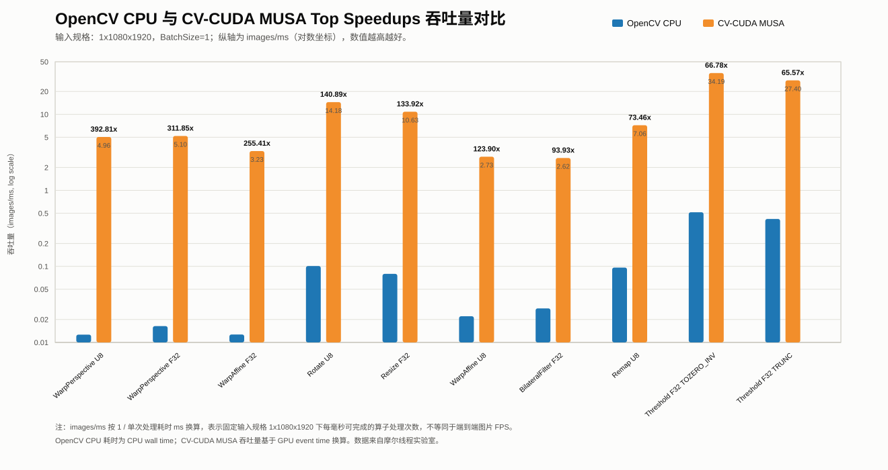

[//]: # "SPDX-FileCopyrightText: Copyright (c) 2022-2025 NVIDIA CORPORATION & AFFILIATES. All rights reserved."
[//]: # "SPDX-License-Identifier: Apache-2.0"

# OpenCV CPU Versus CV-CUDA MUSA Benchmark Comparison

This page records the OpenCV CPU versus CV-CUDA MUSA benchmark comparison collected for the MUSA port.
The native CV-CUDA MUSA benchmark results are documented separately in [Native CV-CUDA Benchmark Results: MUSA and CUDA](musa_native_benchmark.md).

Back to [CV-CUDA With MUSA](musa.md).

## Benchmark setup

- Benchmark harness: `bench/bench_compare/opencv_cvcuda_benchmark_compare.cpp`
- Result generator: `bench/bench_compare/run_compare.py` invokes the harness and writes CSV/Markdown comparison output.
- Selected backend: `MUSA`
- OpenCV source: OpenCV `5.x`, built locally by `bench/bench_compare/build_opencv.py` or supplied through `--opencv-dir`.
- CV-CUDA source/API: this repository checkout.
- CV-CUDA build: a MUSA benchmark-capable build tree, for example `build-musa-bench-s5000`.
- Integration mode: one benchmark case list, two backends: `opencv_cpu` and direct `cvcuda_gpu` API calls
- Input compared: `1x1080x1920`, with U8 or F32 data depending on operator support
- Timing: OpenCV CPU wall time; CV-CUDA MUSA GPU event time plus CPU submit/sync wall time

## Test platform

The benchmark data on this page was collected on the following platform:

| Item | Value |
| --- | --- |
| OS | Ubuntu 22.04.4 LTS (Jammy Jellyfish) |
| CPU architecture | x86_64 |
| CPU | AMD Ryzen 7 5700G with Radeon Graphics |
| CPU cores / threads | 8 cores / 16 threads |
| CPU max frequency | 3.8 GHz |
| NUMA nodes | 1 |
| MUSA driver version | 5.1 |
| MUSA offload architecture used for benchmark build | `mp_31` |

## Reproduce the benchmark

The comparison harness lives in `bench/bench_compare/`. It builds a small executable that links OpenCV `core,imgproc` and the MUSA-built CV-CUDA libraries, then runs the same case list through OpenCV CPU and direct CV-CUDA GPU API calls.

### 1. Build CV-CUDA with MUSA benchmark support

Use the architecture that matches the GPU under test:

```bash
# S4000
ci/build.sh release build-musa-bench-s4000 \
  -DUSE_MUSA=ON \
  -DCV_CUDA_MUSA_ARCH=mp_22 \
  -DBUILD_TESTS=OFF \
  -DBUILD_PYTHON=OFF \
  -DBUILD_BENCH=ON

# S5000
ci/build.sh release build-musa-bench-s5000 \
  -DUSE_MUSA=ON \
  -DCV_CUDA_MUSA_ARCH=mp_31 \
  -DBUILD_TESTS=OFF \
  -DBUILD_PYTHON=OFF \
  -DBUILD_BENCH=ON
```

The benchmark comparison uses the generated CV-CUDA libraries from the selected build tree.

### 2. Run the OpenCV/CV-CUDA comparison harness

From the repository root, run the helper script. The script can fetch/build OpenCV `5.x` automatically, configure the comparison executable, run the benchmark, and generate CSV plus Markdown output:

```bash
python3 bench/bench_compare/run_compare.py \
  --backend MUSA \
  --cvcuda-root . \
  --cvcuda-build build-musa-bench-s5000 \
  --out-dir bench/bench_compare/results/backend_compare_musa
```

For S4000, replace `build-musa-bench-s5000` with `build-musa-bench-s4000`.

If OpenCV has already been built or installed, skip the OpenCV build and point the script at the directory containing `OpenCVConfig.cmake`:

```bash
python3 bench/bench_compare/run_compare.py \
  --backend MUSA \
  --skip-opencv-build \
  --opencv-dir <path-to-opencv-cmake-dir> \
  --cvcuda-root . \
  --cvcuda-build build-musa-bench-s5000 \
  --out-dir bench/bench_compare/results/backend_compare_musa
```

Useful optional arguments:

- `--samples <N>` sets the measured sample count per case. The default is `20`.
- `--warmup <N>` sets warmup iterations before measurement. The default is `5`.
- `--jobs <N>` sets parallel build jobs.
- `--opencv-skip-fetch` reuses an existing OpenCV source tree instead of cloning/fetching it.
- `--opencv-force-clean` removes the OpenCV CMake build directory before rebuilding OpenCV.

The generated files are:

- `opencv_cvcuda_backend_raw.csv`: raw per-backend timing output from the harness.
- `opencv_backend_vs_cvcuda_backend.csv`: joined OpenCV CPU versus CV-CUDA GPU comparison table.
- `opencv_backend_vs_cvcuda_backend.md`: generated Markdown comparison report.

## Summary

| Metric | Value |
| --- | --- |
| Total cases | 65 |
| Faster than OpenCV CPU | 55 cases |
| Slower than OpenCV CPU | 10 cases |
| Average reported speedup | About 41.58x |
| Strongest reported speedup | WarpPerspective U8, 392.81x |
| Input shape | `1x1080x1920` |

The strongest MUSA speedups are in geometric transforms and selected F32 scalar or memory-layout operations.
The slower cases are concentrated in histogram/equalization, Gaussian/median-style filtering, and small U8 morphology/threshold paths.

## Highlight chart

The following chart follows the same comparison style as CV-CUDA benchmark summaries: it highlights representative high-speedup cases and shows both the OpenCV CPU throughput and the CV-CUDA MUSA GPU throughput. Because each benchmark case uses a single `1x1080x1920` image input, throughput is computed as `1 / time_ms` and reported as images/ms. The y-axis uses a log scale, and higher bars are better.



Note: `images/ms` here means the number of fixed-shape `1x1080x1920` benchmark inputs processed per millisecond by a single operator. It does not represent end-to-end image-processing FPS including decode, data transfer, or a full application pipeline.

## Top speedups

| Benchmark | Type | Parameters | OpenCV CPU ms | CV-CUDA MUSA GPU ms | Speedup |
| --- | --- | --- | --- | --- | --- |
| WarpPerspective | U8 | `matrix=bench-default;inverseMap=Y;interpolation=CUBIC;border=REFLECT` | 79.182822 | 0.201580 | 392.81x |
| WarpPerspective | F32 | `matrix=bench-default;inverseMap=Y;interpolation=CUBIC;border=REFLECT` | 61.134257 | 0.196038 | 311.85x |
| WarpAffine | F32 | `matrix=bench-default;inverseMap=Y;interpolation=CUBIC;border=REFLECT` | 78.959218 | 0.309152 | 255.41x |
| Rotate | U8 | `angle=123.456;shift=12.34;interpolation=CUBIC` | 9.934929 | 0.070518 | 140.89x |
| Resize | F32 | `resizeType=EXPAND;interpolation=LINEAR` | 12.602440 | 0.094106 | 133.92x |
| WarpAffine | U8 | `matrix=bench-default;inverseMap=Y;interpolation=CUBIC;border=REFLECT` | 45.416132 | 0.366558 | 123.90x |
| BilateralFilter | F32 | `d=5;sigmaColor=5;sigmaSpace=5;border=REFLECT` | 35.799560 | 0.381130 | 93.93x |
| Remap | U8 | `map=DENSE_IDENTITY;interpolation=LINEAR;border=CONSTANT` | 10.407950 | 0.141686 | 73.46x |
| Threshold | F32 | `type=TOZERO_INV;thresh=auto` | 1.953328 | 0.029250 | 66.78x |
| Threshold | F32 | `type=TRUNC;thresh=auto` | 2.393614 | 0.036502 | 65.57x |

## Cases slower than OpenCV CPU

| Benchmark | Type | Parameters | OpenCV CPU ms | CV-CUDA MUSA GPU ms | Speedup |
| --- | --- | --- | --- | --- | --- |
| Gaussian | U8 | `sigma=1.2;border=REFLECT` | 1.399996 | 2.098884 | 0.67x |
| CalcHist1d | U8 | `histSize=256;range=0..256` | 0.571623 | 0.696230 | 0.82x |
| EqualizeHist | U8 | `channels=1` | 1.076066 | 1.298678 | 0.83x |
| Threshold | U8 | `type=BINARY_INV;thresh=auto;maxval=auto` | 0.040651 | 0.046634 | 0.87x |
| MedianBlur | U8 | `kernel=5x5` | 1.239980 | 1.411794 | 0.88x |
| MorphologyDilate | U8 | `type=DILATE;kernel=3x3;iter=1;border=REPLICATE` | 0.131609 | 0.142106 | 0.93x |
| Threshold | U8 | `type=TRUNC;thresh=auto` | 0.039251 | 0.041354 | 0.95x |
| MorphologyErode | U8 | `type=ERODE;kernel=3x3;iter=1;border=REPLICATE` | 0.136243 | 0.141798 | 0.96x |
| MorphologyOpen | U8 | `type=OPEN;kernel=3x3;iter=1;border=REPLICATE` | 0.263040 | 0.272444 | 0.97x |
| MorphologyClose | U8 | `type=CLOSE;kernel=3x3;iter=1;border=REPLICATE` | 0.266256 | 0.271806 | 0.98x |

## Full benchmark table

| Benchmark | Type | Shape | Parameters | OpenCV CPU ms | CV-CUDA MUSA GPU ms | CPU submit ms | Speedup |
| --- | --- | --- | --- | --- | --- | --- | --- |
| AdaptiveThreshold | U8 | `1x1080x1920` | `method=GAUSSIAN;type=BINARY;blockSize=7;C=-2.3` | 3.234968 | 0.220906 | 0.837914 | 14.64x |
| AverageBlur | F32 | `1x1080x1920` | `kernel=7x7;border=REPLICATE` | 5.156392 | 0.521230 | 1.147614 | 9.89x |
| AverageBlur | U8 | `1x1080x1920` | `kernel=7x7;border=REPLICATE` | 1.150562 | 0.531228 | 1.045918 | 2.17x |
| BilateralFilter | F32 | `1x1080x1920` | `d=5;sigmaColor=5;sigmaSpace=5;border=REFLECT` | 35.799560 | 0.381130 | 0.998828 | 93.93x |
| BilateralFilter | U8 | `1x1080x1920` | `d=5;sigmaColor=5;sigmaSpace=5;border=REFLECT` | 11.374546 | 0.387000 | 1.020898 | 29.39x |
| CalcHist1d | U8 | `1x1080x1920` | `histSize=256;range=0..256` | 0.571623 | 0.696230 | 0.805689 | 0.82x |
| CenterCrop | F32 | `1x1080x1920` | `crop=quarter` | 0.369981 | 0.020194 | 0.091939 | 18.32x |
| CenterCrop | U8 | `1x1080x1920` | `crop=quarter` | 0.062993 | 0.021162 | 0.119257 | 2.98x |
| ConvertTo | F32 | `1x1080x1920` | `alpha=0.75;beta=0.125` | 1.624142 | 0.028870 | 0.483159 | 56.26x |
| ConvertTo | U8 | `1x1080x1920` | `alpha=0.75;beta=0.125` | 0.248960 | 0.033194 | 0.121381 | 7.50x |
| CopyMakeBorder | F32 | `1x1080x1920` | `top=srcH/2;left=srcW/2;border=REFLECT101` | 4.267711 | 0.121844 | 0.212192 | 35.03x |
| CopyMakeBorder | U8 | `1x1080x1920` | `top=srcH/2;left=srcW/2;border=REFLECT101` | 0.632758 | 0.117730 | 0.235107 | 5.37x |
| CvtColor | U8 | `1x1080x1920` | `code=GRAY2RGB` | 0.124146 | 0.029862 | 0.113880 | 4.16x |
| CvtColor | U8 | `1x1080x1920` | `code=HSV2RGB` | 2.210784 | 0.054792 | 0.115999 | 40.35x |
| CvtColor | U8 | `1x1080x1920` | `code=RGB2BGR` | 0.285996 | 0.035550 | 0.649143 | 8.04x |
| CvtColor | U8 | `1x1080x1920` | `code=RGB2GRAY` | 0.593571 | 0.031678 | 0.122875 | 18.74x |
| CvtColor | U8 | `1x1080x1920` | `code=RGB2HSV` | 2.312214 | 0.048808 | 0.114739 | 47.37x |
| CvtColor | U8 | `1x1080x1920` | `code=RGB2RGBA` | 0.498454 | 0.040168 | 0.092665 | 12.41x |
| CvtColor | U8 | `1x1080x1920` | `code=RGB2YUV` | 1.273646 | 0.035202 | 0.130408 | 36.18x |
| CvtColor | U8 | `1x1080x1920` | `code=RGBA2RGB` | 0.489490 | 0.030492 | 0.121262 | 16.05x |
| CvtColor | U8 | `1x1080x1920` | `code=YUV2RGB` | 1.115149 | 0.037528 | 0.126172 | 29.72x |
| EqualizeHist | U8 | `1x1080x1920` | `channels=1` | 1.076066 | 1.298678 | 1.947073 | 0.83x |
| Flip | F32 | `1x1080x1920` | `flipType=BOTH` | 4.268469 | 0.113512 | 0.213718 | 37.60x |
| Flip | F32 | `1x1080x1920` | `flipType=HORIZONTAL` | 2.346021 | 0.067498 | 0.723727 | 34.76x |
| Flip | F32 | `1x1080x1920` | `flipType=VERTICAL` | 1.854848 | 0.029102 | 0.121391 | 63.74x |
| Flip | U8 | `1x1080x1920` | `flipType=BOTH` | 0.952534 | 0.030966 | 0.710000 | 30.76x |
| Flip | U8 | `1x1080x1920` | `flipType=HORIZONTAL` | 0.888228 | 0.030646 | 0.111739 | 28.98x |
| Flip | U8 | `1x1080x1920` | `flipType=VERTICAL` | 0.057961 | 0.026444 | 0.119739 | 2.19x |
| Gaussian | F32 | `1x1080x1920` | `sigma=1.2;border=REFLECT` | 4.856916 | 2.979558 | 6.389038 | 1.63x |
| Gaussian | U8 | `1x1080x1920` | `sigma=1.2;border=REFLECT` | 1.399996 | 2.098884 | 5.118437 | 0.67x |
| Laplacian | F32 | `1x1080x1920` | `ksize=1;scale=1;border=REFLECT101` | 2.730022 | 0.412768 | 0.928498 | 6.61x |
| Laplacian | U8 | `1x1080x1920` | `ksize=1;scale=1;border=REFLECT101` | 1.041948 | 0.395412 | 1.088131 | 2.64x |
| MedianBlur | F32 | `1x1080x1920` | `kernel=5x5` | 8.366364 | 1.819916 | 3.986753 | 4.60x |
| MedianBlur | U8 | `1x1080x1920` | `kernel=5x5` | 1.239980 | 1.411794 | 3.692906 | 0.88x |
| MorphologyClose | F32 | `1x1080x1920` | `type=CLOSE;kernel=3x3;iter=1;border=REPLICATE` | 4.001259 | 0.289994 | 0.901179 | 13.80x |
| MorphologyClose | U8 | `1x1080x1920` | `type=CLOSE;kernel=3x3;iter=1;border=REPLICATE` | 0.266256 | 0.271806 | 0.372289 | 0.98x |
| MorphologyDilate | F32 | `1x1080x1920` | `type=DILATE;kernel=3x3;iter=1;border=REPLICATE` | 2.597785 | 0.157694 | 0.233207 | 16.47x |
| MorphologyDilate | U8 | `1x1080x1920` | `type=DILATE;kernel=3x3;iter=1;border=REPLICATE` | 0.131609 | 0.142106 | 1.405374 | 0.93x |
| MorphologyErode | F32 | `1x1080x1920` | `type=ERODE;kernel=3x3;iter=1;border=REPLICATE` | 2.615378 | 0.147160 | 0.249609 | 17.77x |
| MorphologyErode | U8 | `1x1080x1920` | `type=ERODE;kernel=3x3;iter=1;border=REPLICATE` | 0.136243 | 0.141798 | 0.311098 | 0.96x |
| MorphologyOpen | F32 | `1x1080x1920` | `type=OPEN;kernel=3x3;iter=1;border=REPLICATE` | 4.279489 | 0.290520 | 0.894461 | 14.73x |
| MorphologyOpen | U8 | `1x1080x1920` | `type=OPEN;kernel=3x3;iter=1;border=REPLICATE` | 0.263040 | 0.272444 | 1.126498 | 0.97x |
| Remap | F32 | `1x1080x1920` | `map=DENSE_IDENTITY;interpolation=LINEAR;border=CONSTANT` | 5.556743 | 0.125698 | 0.218579 | 44.21x |
| Remap | F32 | `1x1080x1920` | `map=DENSE_IDENTITY;interpolation=NEAREST;border=CONSTANT` | 4.039466 | 0.076092 | 0.579166 | 53.09x |
| Remap | U8 | `1x1080x1920` | `map=DENSE_IDENTITY;interpolation=LINEAR;border=CONSTANT` | 10.407950 | 0.141686 | 0.261639 | 73.46x |
| Remap | U8 | `1x1080x1920` | `map=DENSE_IDENTITY;interpolation=NEAREST;border=CONSTANT` | 3.026408 | 0.166220 | 0.248590 | 18.21x |
| Resize | F32 | `1x1080x1920` | `resizeType=EXPAND;interpolation=LINEAR` | 12.602440 | 0.094106 | 0.179146 | 133.92x |
| Resize | U8 | `1x1080x1920` | `resizeType=EXPAND;interpolation=LINEAR` | 5.042893 | 0.110880 | 0.208169 | 45.48x |
| Rotate | F32 | `1x1080x1920` | `angle=123.456;shift=12.34;interpolation=CUBIC` | 24.381136 | 0.678902 | 0.767832 | 35.91x |
| Rotate | U8 | `1x1080x1920` | `angle=123.456;shift=12.34;interpolation=CUBIC` | 9.934929 | 0.070518 | 0.150899 | 140.89x |
| Threshold | F32 | `1x1080x1920` | `type=BINARY;thresh=auto;maxval=auto` | 2.088380 | 0.039306 | 0.092285 | 53.13x |
| Threshold | F32 | `1x1080x1920` | `type=BINARY_INV;thresh=auto;maxval=auto` | 1.922647 | 0.039602 | 0.090333 | 48.55x |
| Threshold | F32 | `1x1080x1920` | `type=TOZERO;thresh=auto` | 2.274301 | 0.039328 | 0.090235 | 57.83x |
| Threshold | F32 | `1x1080x1920` | `type=TOZERO_INV;thresh=auto` | 1.953328 | 0.029250 | 0.118046 | 66.78x |
| Threshold | F32 | `1x1080x1920` | `type=TRUNC;thresh=auto` | 2.393614 | 0.036502 | 0.100948 | 65.57x |
| Threshold | U8 | `1x1080x1920` | `type=BINARY;thresh=auto;maxval=auto` | 0.070407 | 0.053384 | 0.124660 | 1.32x |
| Threshold | U8 | `1x1080x1920` | `type=BINARY_INV;thresh=auto;maxval=auto` | 0.040651 | 0.046634 | 0.141306 | 0.87x |
| Threshold | U8 | `1x1080x1920` | `type=BINARY_OTSU;thresh=0;maxval=auto` | 0.539898 | 0.165402 | 0.234084 | 3.26x |
| Threshold | U8 | `1x1080x1920` | `type=TOZERO;thresh=auto` | 0.062134 | 0.040306 | 0.118472 | 1.54x |
| Threshold | U8 | `1x1080x1920` | `type=TOZERO_INV;thresh=auto` | 0.061600 | 0.032008 | 0.147072 | 1.92x |
| Threshold | U8 | `1x1080x1920` | `type=TRUNC;thresh=auto` | 0.039251 | 0.041354 | 0.117302 | 0.95x |
| WarpAffine | F32 | `1x1080x1920` | `matrix=bench-default;inverseMap=Y;interpolation=CUBIC;border=REFLECT` | 78.959218 | 0.309152 | 0.915088 | 255.41x |
| WarpAffine | U8 | `1x1080x1920` | `matrix=bench-default;inverseMap=Y;interpolation=CUBIC;border=REFLECT` | 45.416132 | 0.366558 | 1.012982 | 123.90x |
| WarpPerspective | F32 | `1x1080x1920` | `matrix=bench-default;inverseMap=Y;interpolation=CUBIC;border=REFLECT` | 61.134257 | 0.196038 | 1.760793 | 311.85x |
| WarpPerspective | U8 | `1x1080x1920` | `matrix=bench-default;inverseMap=Y;interpolation=CUBIC;border=REFLECT` | 79.182822 | 0.201580 | 0.298198 | 392.81x |
