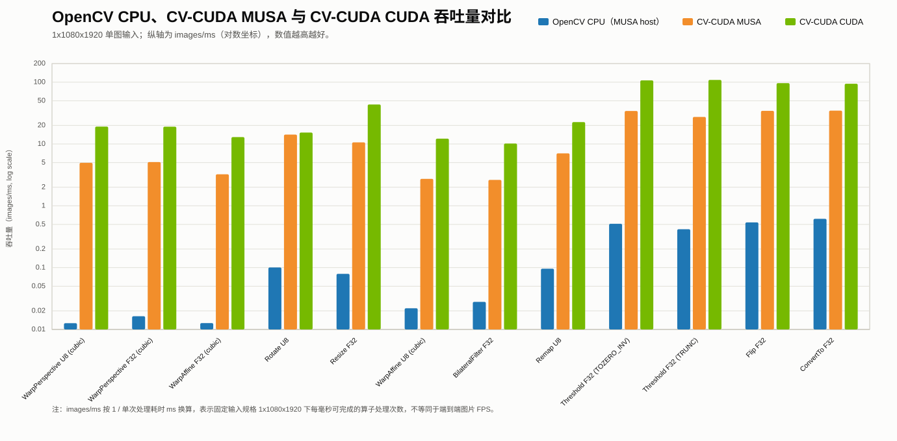

[//]: # "SPDX-FileCopyrightText: Copyright (c) 2022-2025 NVIDIA CORPORATION & AFFILIATES. All rights reserved."
[//]: # "SPDX-License-Identifier: Apache-2.0"

# MUSA and CUDA OpenCV Benchmark Comparison

This page compares the MUSA and CUDA OpenCV benchmark baselines side by side.
It is separate from the native benchmark report and the OpenCV CPU versus CV-CUDA MUSA comparison:

- [Native CV-CUDA Benchmark Results: MUSA and CUDA](musa_native_benchmark.md)
- [OpenCV CPU Versus CV-CUDA MUSA Benchmark Comparison](musa_opencv_comparison_benchmark.md)

Both runs use the same `bench/bench_compare/` comparison harness and OpenCV build flow, but they were collected on different host/GPU platforms.

Back to [CV-CUDA With MUSA](musa.md).

## How to read this table

- `OpenCV CPU ms (MUSA host)` is the OpenCV CPU baseline measured on the MUSA benchmark host.
- `CV-CUDA MUSA GPU ms` is the CV-CUDA GPU time measured on the MUSA device.
- `OpenCV CPU ms (CUDA host)` is the OpenCV CPU baseline measured on the CUDA benchmark host.
- `CV-CUDA CUDA GPU ms` is the CV-CUDA GPU time measured on the CUDA device.
- The OpenCV CPU columns are **per-platform baselines**. They can differ because the MUSA and CUDA runs used different host CPUs, CPU frequency behavior, SIMD dispatch paths, and system state.
- Use each page's speedup only as a within-platform comparison. Use this page as a cross-platform reference table, not as a strict same-machine GPU benchmark.

## Platform summary

| Item | MUSA benchmark platform | CUDA benchmark platform |
| --- | --- | --- |
| OS | Ubuntu 22.04.4 LTS | Ubuntu 22.04.5 LTS |
| CPU | AMD Ryzen 7 5700G with Radeon Graphics | 11th Gen Intel Core i7-11700K @ 3.60GHz |
| CPU cores / threads | 8 cores / 16 threads | 8 cores / 16 threads |
| CPU max frequency | 3.8 GHz | 5.0 GHz |
| GPU backend | MUSA | CUDA |
| GPU / target | S5000-class run using `mp_31` benchmark build | NVIDIA GeForce RTX 4080 |
| Driver/runtime | MUSA driver 5.1 | NVIDIA driver 590.48.01, CUDA 13.1 reported by driver |
| Input shape | `1x1080x1920` | `1x1080x1920` |

## Overall summary

| Metric | MUSA run | CUDA run |
| --- | --- | --- |
| Total cases | 65 | 65 |
| Faster than OpenCV CPU | 55 cases | 65 cases |
| Slower than OpenCV CPU | 10 cases | 0 cases |
| Average reported speedup | About 41.58x | Not summarized in the source table |
| Strongest reported speedup | WarpPerspective U8, 392.81x | WarpPerspective U8, 703.98x |

## Highlight chart

The following chart highlights representative cases from the cross-platform comparison and shows OpenCV CPU, CV-CUDA MUSA GPU, and CV-CUDA CUDA GPU throughput together. Because each benchmark case uses a single `1x1080x1920` image input, throughput is computed as `1 / time_ms` and reported as images/ms. The y-axis uses a log scale, and higher bars are better.

The chart focuses on absolute throughput only. A short note below the figure explains the images/ms conversion. The speedup values remain in the table below; the OpenCV CPU baselines are platform-specific and should not be read as same-machine CPU results.

## Baseline comparison table

| Benchmark | Type | Parameters | OpenCV CPU ms (MUSA host) | CV-CUDA MUSA GPU ms | MUSA speedup | OpenCV CPU ms (CUDA host) | CV-CUDA CUDA GPU ms | CUDA speedup |
| --- | --- | --- | --- | --- | --- | --- | --- | --- |
| AdaptiveThreshold | U8 | `method=GAUSSIAN;type=BINARY;blockSize=7;C=-2.3` | 3.234968 | 0.220906 | 14.64x | 3.076076 | 0.077094 | 39.90x |
| AverageBlur | F32 | `kernel=7x7;border=REPLICATE` | 5.156392 | 0.521230 | 9.89x | 2.875915 | 0.094747 | 30.35x |
| AverageBlur | U8 | `kernel=7x7;border=REPLICATE` | 1.150562 | 0.531228 | 2.17x | 0.972061 | 0.099624 | 9.76x |
| BilateralFilter | F32 | `d=5;sigmaColor=5;sigmaSpace=5;border=REFLECT` | 35.799560 | 0.381130 | 93.93x | 21.946449 | 0.098315 | 223.23x |
| BilateralFilter | U8 | `d=5;sigmaColor=5;sigmaSpace=5;border=REFLECT` | 11.374546 | 0.387000 | 29.39x | 10.105936 | 0.098098 | 103.02x |
| CalcHist1d | U8 | `histSize=256;range=0..256` | 0.571623 | 0.696230 | 0.82x | 0.534055 | 0.079394 | 6.73x |
| CenterCrop | F32 | `crop=quarter` | 0.369981 | 0.020194 | 18.32x | 0.068816 | 0.004866 | 14.14x |
| CenterCrop | U8 | `crop=quarter` | 0.062993 | 0.021162 | 2.98x | 0.019789 | 0.005106 | 3.88x |
| ConvertTo | F32 | `alpha=0.75;beta=0.125` | 1.624142 | 0.028870 | 56.26x | 0.398181 | 0.010600 | 37.56x |
| ConvertTo | U8 | `alpha=0.75;beta=0.125` | 0.248960 | 0.033194 | 7.50x | 0.222275 | 0.010224 | 21.74x |
| CopyMakeBorder | F32 | `top=srcH/2;left=srcW/2;border=REFLECT101` | 4.267711 | 0.121844 | 35.03x | 1.393390 | 0.029893 | 46.61x |
| CopyMakeBorder | U8 | `top=srcH/2;left=srcW/2;border=REFLECT101` | 0.632758 | 0.117730 | 5.37x | 0.505621 | 0.029285 | 17.27x |
| CvtColor | U8 | `code=GRAY2RGB` | 0.124146 | 0.029862 | 4.16x | 0.136541 | 0.011869 | 11.50x |
| CvtColor | U8 | `code=HSV2RGB` | 2.210784 | 0.054792 | 40.35x | 1.571274 | 0.013058 | 120.33x |
| CvtColor | U8 | `code=RGB2BGR` | 0.285996 | 0.035550 | 8.04x | 0.224565 | 0.010853 | 20.69x |
| CvtColor | U8 | `code=RGB2GRAY` | 0.593571 | 0.031678 | 18.74x | 0.358139 | 0.009518 | 37.63x |
| CvtColor | U8 | `code=RGB2HSV` | 2.312214 | 0.048808 | 47.37x | 2.127493 | 0.012317 | 172.73x |
| CvtColor | U8 | `code=RGB2RGBA` | 0.498454 | 0.040168 | 12.41x | 0.490600 | 0.008832 | 55.55x |
| CvtColor | U8 | `code=RGB2YUV` | 1.273646 | 0.035202 | 36.18x | 0.819555 | 0.010517 | 77.93x |
| CvtColor | U8 | `code=RGBA2RGB` | 0.489490 | 0.030492 | 16.05x | 0.298089 | 0.009798 | 30.42x |
| CvtColor | U8 | `code=YUV2RGB` | 1.115149 | 0.037528 | 29.72x | 0.821062 | 0.010285 | 79.83x |
| EqualizeHist | U8 | `channels=1` | 1.076066 | 1.298678 | 0.83x | 0.924160 | 0.096806 | 9.55x |
| Flip | F32 | `flipType=BOTH` | 4.268469 | 0.113512 | 37.60x | 0.313256 | 0.010795 | 29.02x |
| Flip | F32 | `flipType=HORIZONTAL` | 2.346021 | 0.067498 | 34.76x | 0.284368 | 0.010277 | 27.67x |
| Flip | F32 | `flipType=VERTICAL` | 1.854848 | 0.029102 | 63.74x | 0.543770 | 0.010370 | 52.44x |
| Flip | U8 | `flipType=BOTH` | 0.952534 | 0.030966 | 30.76x | 0.069658 | 0.009317 | 7.48x |
| Flip | U8 | `flipType=HORIZONTAL` | 0.888228 | 0.030646 | 28.98x | 0.064675 | 0.009374 | 6.90x |
| Flip | U8 | `flipType=VERTICAL` | 0.057961 | 0.026444 | 2.19x | 0.063541 | 0.009629 | 6.60x |
| Gaussian | F32 | `sigma=1.2;border=REFLECT` | 4.856916 | 2.979558 | 1.63x | 2.257338 | 0.493390 | 4.58x |
| Gaussian | U8 | `sigma=1.2;border=REFLECT` | 1.399996 | 2.098884 | 0.67x | 1.572894 | 0.354970 | 4.43x |
| Laplacian | F32 | `ksize=1;scale=1;border=REFLECT101` | 2.730022 | 0.412768 | 6.61x | 0.767777 | 0.097664 | 7.86x |
| Laplacian | U8 | `ksize=1;scale=1;border=REFLECT101` | 1.041948 | 0.395412 | 2.64x | 0.751843 | 0.098450 | 7.64x |
| MedianBlur | F32 | `kernel=5x5` | 8.366364 | 1.819916 | 4.60x | 6.180950 | 0.621658 | 9.94x |
| MedianBlur | U8 | `kernel=5x5` | 1.239980 | 1.411794 | 0.88x | 1.676605 | 0.403494 | 4.16x |
| MorphologyClose | F32 | `type=CLOSE;kernel=3x3;iter=1;border=REPLICATE` | 4.001259 | 0.289994 | 13.80x | 1.592553 | 0.051818 | 30.73x |
| MorphologyClose | U8 | `type=CLOSE;kernel=3x3;iter=1;border=REPLICATE` | 0.266256 | 0.271806 | 0.98x | 0.254054 | 0.049256 | 5.16x |
| MorphologyDilate | F32 | `type=DILATE;kernel=3x3;iter=1;border=REPLICATE` | 2.597785 | 0.157694 | 16.47x | 0.803642 | 0.026818 | 29.97x |
| MorphologyDilate | U8 | `type=DILATE;kernel=3x3;iter=1;border=REPLICATE` | 0.131609 | 0.142106 | 0.93x | 0.138804 | 0.026312 | 5.28x |
| MorphologyErode | F32 | `type=ERODE;kernel=3x3;iter=1;border=REPLICATE` | 2.615378 | 0.147160 | 17.77x | 0.812646 | 0.026894 | 30.22x |
| MorphologyErode | U8 | `type=ERODE;kernel=3x3;iter=1;border=REPLICATE` | 0.136243 | 0.141798 | 0.96x | 0.139489 | 0.026346 | 5.29x |
| MorphologyOpen | F32 | `type=OPEN;kernel=3x3;iter=1;border=REPLICATE` | 4.279489 | 0.290520 | 14.73x | 1.506190 | 0.049789 | 30.25x |
| MorphologyOpen | U8 | `type=OPEN;kernel=3x3;iter=1;border=REPLICATE` | 0.263040 | 0.272444 | 0.97x | 0.294613 | 0.049074 | 6.00x |
| Remap | F32 | `map=DENSE_IDENTITY;interpolation=LINEAR;border=CONSTANT` | 5.556743 | 0.125698 | 44.21x | 3.429315 | 0.047331 | 72.45x |
| Remap | F32 | `map=DENSE_IDENTITY;interpolation=NEAREST;border=CONSTANT` | 4.039466 | 0.076092 | 53.09x | 1.855064 | 0.044346 | 41.83x |
| Remap | U8 | `map=DENSE_IDENTITY;interpolation=LINEAR;border=CONSTANT` | 10.407950 | 0.141686 | 73.46x | 3.824538 | 0.044267 | 86.40x |
| Remap | U8 | `map=DENSE_IDENTITY;interpolation=NEAREST;border=CONSTANT` | 3.026408 | 0.166220 | 18.21x | 1.814093 | 0.041357 | 43.86x |
| Resize | F32 | `resizeType=EXPAND;interpolation=LINEAR` | 12.602440 | 0.094106 | 133.92x | 3.422582 | 0.022971 | 148.99x |
| Resize | U8 | `resizeType=EXPAND;interpolation=LINEAR` | 5.042893 | 0.110880 | 45.48x | 5.011410 | 0.022170 | 226.05x |
| Rotate | F32 | `angle=123.456;shift=12.34;interpolation=CUBIC` | 24.381136 | 0.678902 | 35.91x | 10.033368 | 0.065651 | 152.83x |
| Rotate | U8 | `angle=123.456;shift=12.34;interpolation=CUBIC` | 9.934929 | 0.070518 | 140.89x | 8.572732 | 0.065363 | 131.16x |
| Threshold | F32 | `type=BINARY;thresh=auto;maxval=auto` | 2.088380 | 0.039306 | 53.13x | 0.451076 | 0.009176 | 49.16x |
| Threshold | F32 | `type=BINARY_INV;thresh=auto;maxval=auto` | 1.922647 | 0.039602 | 48.55x | 0.409852 | 0.009158 | 44.75x |
| Threshold | F32 | `type=TOZERO;thresh=auto` | 2.274301 | 0.039328 | 57.83x | 0.395450 | 0.009286 | 42.58x |
| Threshold | F32 | `type=TOZERO_INV;thresh=auto` | 1.953328 | 0.029250 | 66.78x | 0.460283 | 0.009358 | 49.18x |
| Threshold | F32 | `type=TRUNC;thresh=auto` | 2.393614 | 0.036502 | 65.57x | 0.387479 | 0.009202 | 42.11x |
| Threshold | U8 | `type=BINARY;thresh=auto;maxval=auto` | 0.070407 | 0.053384 | 1.32x | 0.064804 | 0.009435 | 6.87x |
| Threshold | U8 | `type=BINARY_INV;thresh=auto;maxval=auto` | 0.040651 | 0.046634 | 0.87x | 0.064810 | 0.009221 | 7.03x |
| Threshold | U8 | `type=BINARY_OTSU;thresh=0;maxval=auto` | 0.539898 | 0.165402 | 3.26x | 0.645483 | 0.021851 | 29.54x |
| Threshold | U8 | `type=TOZERO;thresh=auto` | 0.062134 | 0.040306 | 1.54x | 0.058069 | 0.007686 | 7.55x |
| Threshold | U8 | `type=TOZERO_INV;thresh=auto` | 0.061600 | 0.032008 | 1.92x | 0.059251 | 0.007768 | 7.63x |
| Threshold | U8 | `type=TRUNC;thresh=auto` | 0.039251 | 0.041354 | 0.95x | 0.058002 | 0.008195 | 7.08x |
| WarpAffine | F32 | `matrix=bench-default;inverseMap=Y;interpolation=CUBIC;border=REFLECT` | 78.959218 | 0.309152 | 255.41x | 34.028968 | 0.077392 | 439.70x |
| WarpAffine | U8 | `matrix=bench-default;inverseMap=Y;interpolation=CUBIC;border=REFLECT` | 45.416132 | 0.366558 | 123.90x | 42.769155 | 0.081970 | 521.77x |
| WarpPerspective | F32 | `matrix=bench-default;inverseMap=Y;interpolation=CUBIC;border=REFLECT` | 61.134257 | 0.196038 | 311.85x | 27.839121 | 0.052518 | 530.08x |
| WarpPerspective | U8 | `matrix=bench-default;inverseMap=Y;interpolation=CUBIC;border=REFLECT` | 79.182822 | 0.201580 | 392.81x | 36.821944 | 0.052306 | 703.98x |
